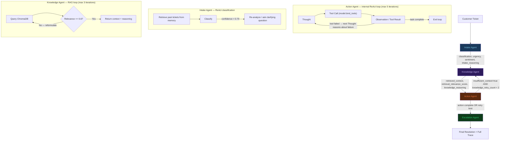

# Multi-Agent Customer Support System

A portfolio-grade multi-agent AI system built to demonstrate **explicit ReAct reasoning**, **real LLM tool-calling**, **multi-agent orchestration with LangGraph**, and **retrieval-augmented reasoning** — all wired together into a live demo with streaming trace output.

> **Built for**: FAANG internship/job applications — the agentic architecture is the entire point.

---

## Architecture



### Two Levels of Retry (Critical Design Decision)

| Level | Where | What | Max |
|---|---|---|---|
| **Intra-agent** | Inside Action Agent's ReAct loop | Tool failures — next Thought explicitly reasons about the error | 5 iterations |
| **Inter-agent** | LangGraph conditional edge | Knowledge gap (not a tool failure) — re-retrieval from ChromaDB | 2 graph loops |

`recursion_limit=15` is set on every graph invocation to fail predictably, not hang.

---

## Why ReAct + LangGraph?

A simple chain (`classify → retrieve → summarize`) cannot:

1. **Retry on tool failure with adapted reasoning** — if `process_refund` fails because an account is locked, a chain has no mechanism to reason about the error and try `check_account_status` first. A ReAct loop makes the failure an Observation that drives the next Thought.

2. **Loop back based on runtime conditions** — if the action agent determines the retrieved context is insufficient (a knowledge gap discovered during tool execution, not predictable at routing time), LangGraph's conditional edges route back to the knowledge agent. A chain can't do this.

3. **Carry reasoning across agents** — each agent produces an explicit reasoning summary (`intake_reasoning`, `knowledge_reasoning`) that the next agent receives in its context. This is multi-agent reasoning handoff, not just data passing.

4. **Produce an auditable trace** — every Thought/Action/Observation from every agent is stored in a shared state list and surfaced in the demo. The escalation agent reasons over the FULL trace, citing specific evidence. A chain produces a final answer; this system produces a reasoning trail.

---

## Sample Full Reasoning Trace

Below is a real trace from TC-06 (account locked — tool failure + intra-loop retry):

```
[INTAKE | iter 1]
  THOUGHT: Analyzing ticket for user u002. Found 0 past tickets. Proceeding with classification.
  ACTION: classify_ticket(ticket_text, user_id, past_tickets)
  OBSERVATION: {"classification": "refund", "urgency": "high", "sentiment": "negative",
                "classification_confidence": 0.88,
                "intake_reasoning": "Customer explicitly requests refund for order 1003 with
                 frustrated tone ('waiting too long'). Direct refund request, clear order ID."}

[KNOWLEDGE | iter 1]
  THOUGHT: Iteration 1: Searching for context about 'refund order 1003'. Initial query.
  ACTION: vector_search(query='refund order 1003', k=4)
  OBSERVATION: Retrieved 4 chunks from {'refund_policy.md', 'returns_process.md'}. 
               Best similarity: 0.712. Relevance SUFFICIENT — stopping search.

[ACTION | iter 1]
  THOUGHT: I need to process a refund for order 1003 for user u002. Let me first check
           the order status to confirm it's eligible, then process the refund.
  ACTION: check_order_status({"order_id": "1003"})
  OBSERVATION: {"order_id": "1003", "user_id": "u002", "status": "delivered",
                "amount": 149.0, "refund_eligible": true, "refunded": false}

[ACTION | iter 2]
  THOUGHT: Order 1003 is delivered and eligible. Proceeding with refund for u002, amount 149.00.
  ACTION: process_refund({"order_id": "1003", "user_id": "u002", "amount": 149.0})
  OBSERVATION: {"success": false, "error": true, "status_code": 403,
                "detail": "Account is locked. Refund cannot be processed until account is unlocked."}

[ACTION | iter 3]
  THOUGHT: The refund failed because account u002 is LOCKED. I cannot process the refund
           directly. I should check the account status to understand why it's locked,
           then determine if I can unlock it or if this needs escalation.
  ACTION: check_account_status({"user_id": "u002"})
  OBSERVATION: {"user_id": "u002", "name": "Bob Smith", "email": "bob@example.com",
                "status": "locked", "plan": "basic"}

[ACTION | iter 4]
  THOUGHT: Account u002 (Bob Smith) is locked. I cannot update account status directly
           through my tools — only reset_password works for locked accounts. The refund
           requires the account to be unlocked first, which needs human intervention.
           I'll send a password reset which may help with account recovery, but the
           underlying lock needs a support specialist to resolve.
  ACTION: reset_password({"user_id": "u002", "method": "email"})
  OBSERVATION: {"success": true, "message": "Password reset link sent via email",
                "sent_to": "bob@example.com", "expires_in_minutes": 60}

[ACTION | iter 5 — context evaluation]
  THOUGHT: Context sufficiency check: insufficient_context=False. The retrieved refund
           policy covered eligibility rules, but the account lock situation requires
           human escalation — this is a tool limitation, not a knowledge gap.
  ACTION: evaluate_context_sufficiency()
  OBSERVATION: insufficient_context=False | context was sufficient; account lock is a
               system constraint, not a missing policy.

[ESCALATION | iter 1]
  THOUGHT: Reviewing full trace. Overall confidence: 0.308. Tool success: 0.333 
           (1/3 succeeded). Sentiment: negative. Determining escalation decision.
  ACTION: escalation_decision(full_trace, confidence_breakdown)
  OBSERVATION: decision=escalate | justification="Escalating because action_agent's
               process_refund call failed in iteration 2 with 'Account is locked' (HTTP 403),
               and despite sending a password reset link, the underlying account lock
               blocking the $149.00 refund for order 1003 requires human intervention.
               Additionally, customer sentiment is negative and the issue cannot be
               auto-resolved with available tools."

Final Decision: ESCALATE
Confidence: {retrieval_relevance: 0.712, tool_call_success: 0.333, classification_confidence: 0.88, sentiment_score: 0.25, overall: 0.449}
```

---

## Project Structure

```
support-agent-system/
├── mock_backend.py              # FastAPI in-memory backend (~130 lines)
├── knowledge_base/
│   ├── docs/                    # 12 markdown knowledge base documents
│   └── ingest.py                # ChromaDB ingestion with all-MiniLM-L6-v2
├── agents/
│   ├── state.py                 # LangGraph shared state (Pydantic + TypedDict)
│   ├── intake_agent.py          # ReAct classification + memory retrieval
│   ├── knowledge_agent.py       # RAG loop (max 3 iterations, cosine similarity check)
│   ├── action_agent.py          # ReAct tool-calling loop (max 5 iterations)
│   ├── escalation_agent.py      # Trace-aware decision with ConfidenceBreakdown
│   └── graph.py                 # StateGraph with conditional edges, recursion_limit=15
├── memory/
│   └── ticket_memory.py         # Per-user past ticket embeddings in ChromaDB
├── eval/
│   ├── test_cases.json          # 18 test cases (incl. TC-16 memory behavior test)
│   └── run_eval.py              # Metrics: accuracy, tool success, latency, retrieval relevance
├── api.py                       # FastAPI gateway (POST /ticket, GET /ticket/{id}/trace)
├── frontend/
│   └── app.py                   # Streamlit with live trace streaming
├── requirements.txt
└── README.md
```

---

## Setup & Running

### Prerequisites
- Python 3.11+
- `ANTHROPIC_API_KEY`

### 1. Clone and install
```bash
git clone <repo>
cd support-agent-system
pip install -r requirements.txt
```

### 2. Configure
```bash
cp .env.example .env
# Edit .env: add your ANTHROPIC_API_KEY
# Optionally change CLAUDE_MODEL (default: claude-sonnet-4-5)
```

### 3. Ingest knowledge base
```bash
python knowledge_base/ingest.py
# Optional: test a query
python knowledge_base/ingest.py --test-query "how do I get a refund"
```

### 4. Start the mock backend
```bash
uvicorn mock_backend:app --port 8000 --reload
# Test: curl http://localhost:8000/account/u001
# Test: curl http://localhost:8000/order/1001
```

### 5. Test the Action Agent in isolation *(see the ReAct trace first)*
```bash
python -m agents.action_agent
```
This runs two test cases and prints the full Thought/Action/Observation trace.

### 6. Run the full evaluation
```bash
python eval/run_eval.py
# Or specific cases:
python eval/run_eval.py --cases tc_006 tc_016
```

### 7. Run the Streamlit frontend
```bash
streamlit run frontend/app.py
```

### 8. (Optional) Run the API server
```bash
python api.py
# POST /ticket
curl -X POST http://localhost:8001/ticket \
  -H "Content-Type: application/json" \
  -d '{"ticket_text": "Refund for order 1001", "user_id": "u001"}'
```

---

## Key Demo Points for Interviewers

1. **Visible ReAct trace** — point at the Streamlit frontend: every agent's Thought → Action → Observation is shown live as it happens.

2. **Real tool-calling** — `model.bind_tools(ALL_TOOLS)` — the LLM decides which tool to call and with what arguments, not hardcoded dispatch.

3. **Tool failure + visible adaptation** — load TC-06 (user u002, locked account). Watch the Action Agent's Thought in iteration 3 explicitly say "the refund failed because the account is LOCKED — I need to check account status first."

4. **Memory-driven escalation** — run TC-16 in eval. The intake agent retrieves 3 unresolved prior tickets and adjusts its reasoning before the ticket even reaches the action agent.

5. **ConfidenceBreakdown** — every escalation decision shows named components (retrieval_relevance, tool_call_success, classification_confidence, sentiment_score) and cites specific trace evidence in its justification.

---

## Tech Stack

| Component | Technology |
|---|---|
| Orchestration | LangGraph (StateGraph) |
| LLM | Anthropic Claude (configurable via `CLAUDE_MODEL` in `.env`) |
| Tool-calling | LangChain `model.bind_tools()` + `@tool` decorator |
| Vector DB | ChromaDB (local, persistent) |
| Embeddings | `sentence-transformers/all-MiniLM-L6-v2` (local, no API cost) |
| Backend | FastAPI (in-memory, ~130 lines) |
| Frontend | Streamlit |
| State schema | Pydantic + TypedDict |
